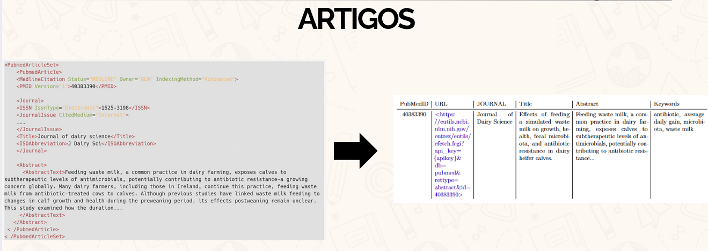
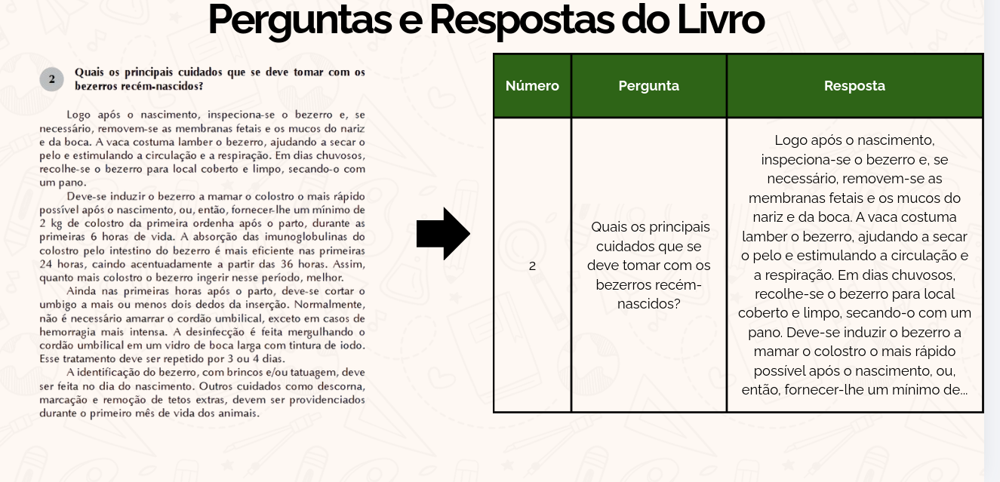
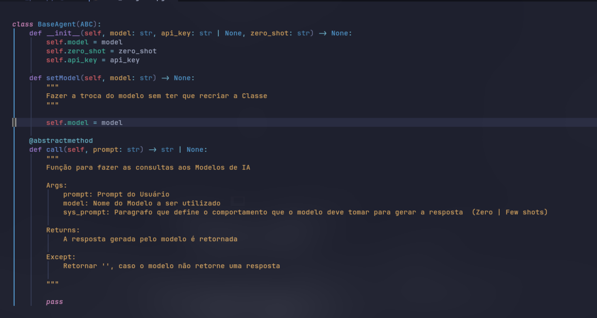
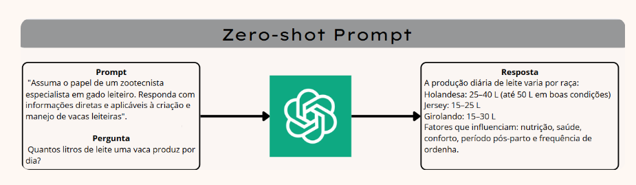
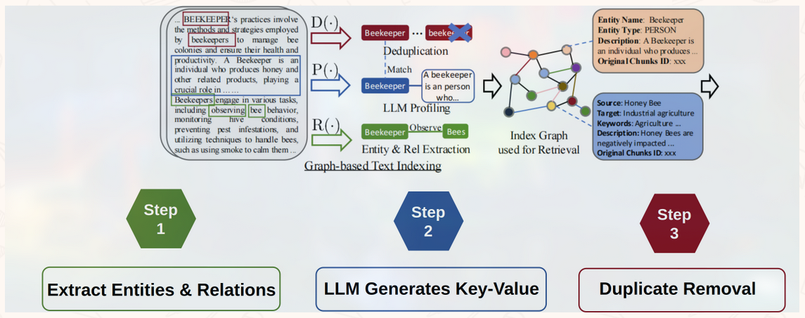
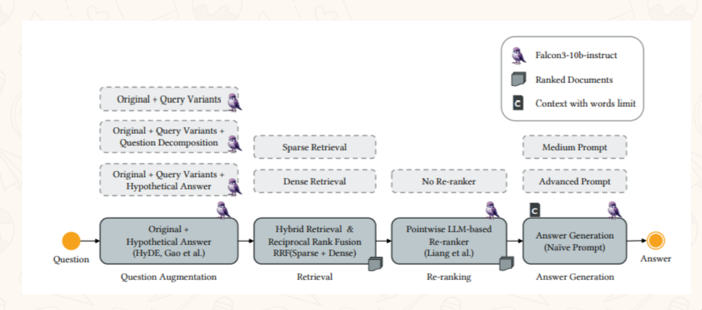
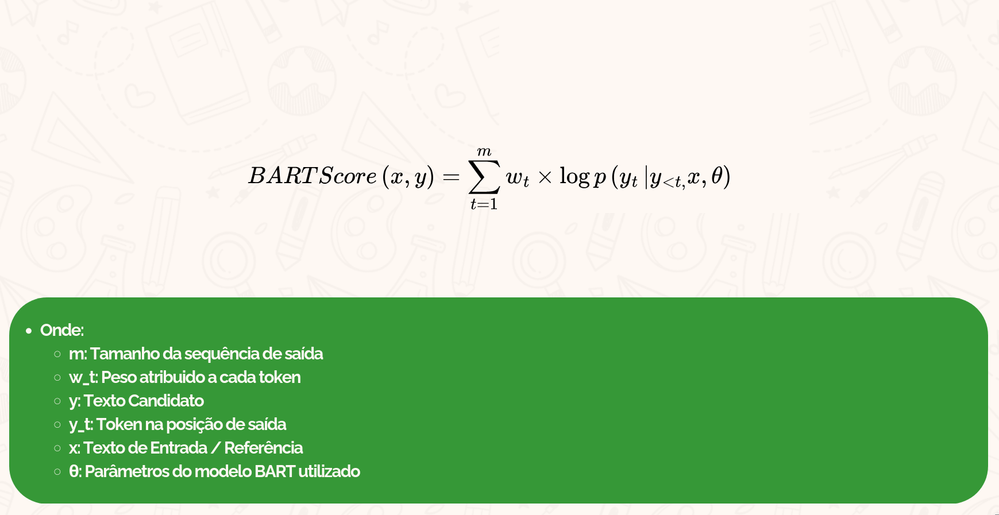
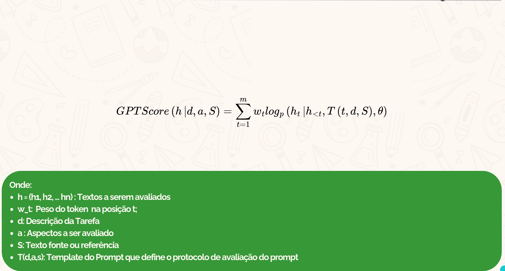
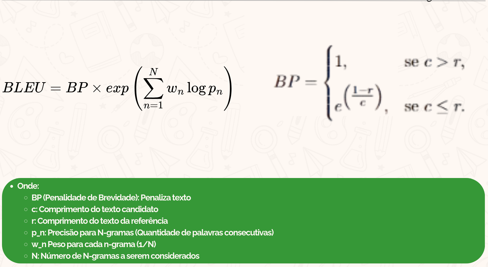
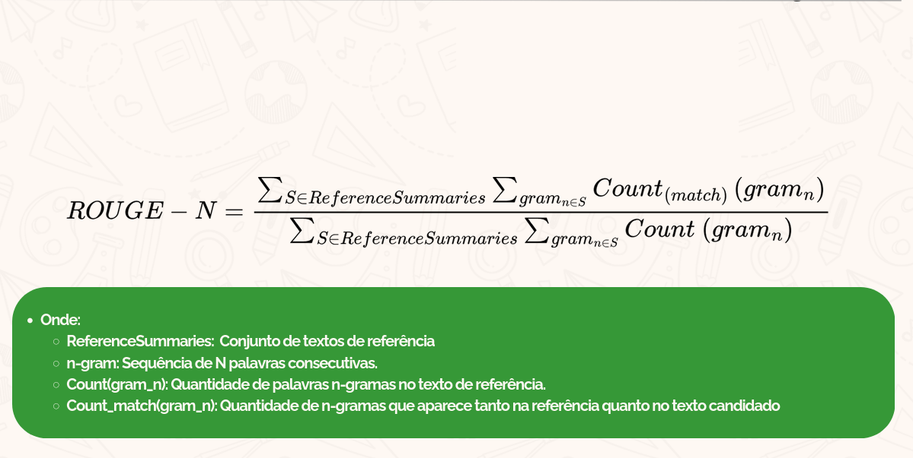

# Análise Exploratoria de Aplicações de LLMs

Analise sobre o uso de LLMs no campo da pecuária leiteira, como a qualidade pode ser afetada por técnicas de aprimoramento como Zero-shot, Few-shot e RAG.
## Desenvolvimento

O objetivo desse presente repositório é armazenar as funções usadas para analisar as técnicas. Então esse repositório comporta as seguintes implementações

## WebCrawler
- ## WebCrawler para a Coleta de informações de Artigos Cientificos sobre Pecuária Leiteira

 - Dividida em 2 responsabilidades especificas:
    
    - ### 1º Coleta de Artigos
     Responsável por fazer a extração de dados espeficificos dos artigos retornados pela resposta JSON da API do [PubMed](https://pubmed.ncbi.nlm.nih.gov/) e converter-los para uma tabela CSV.

    

    
    <em>Extraçao de dados do JSON e conversão para CSV. **Fonte:** Elaborado pelo autor (2025)</em>
    

    Onde armazenamos os seguintes dados:
    - ID, URL, Journal, Titulo, Resumo, Palavras Chaves

     Com a Url coletada na etapa anterior fazemos o download dos PDF dos artigos para alimentação do RAG.

 - ### 2º Extração de Perguntas do Livro
  Como base de conhecimento para fazer uma avaliação da qualidade das respostas geradas pelo modelos em relação a especialista na área, utilizamos o livro [500 Perguntas e Respostas - Pecuária Leiteira](https://www.infoteca.cnptia.embrapa.br/bitstream/doc/929737/1/500perguntasgadoleite.pdf), a qual uniram 50 especialistas na área leiteira para responder perguntas rotineiras dentro do campo da pecuária leiteira

  
  <em>Extraçao das Perguntas do Livro e conversão para CSV. **Fonte:** Elaborado pelo autor (2025)</em>

  Desse modo, extraimos o número da pergunta, a pergunta realizada e a resposta. Convertendo ela para CSV para facilitar o manuseio na etapa de avaliação.

## Modelos

Para fazer a avaliação dos modelos, foi implementado classe contrato para definir a estruta padronizada que cada modelo ou serviço de api deveria seguir para uso.

<em>**Fonte:** Elaborado pelo autor (2025)</em>

Os modelos avaliados nesse projeto foram:
- Familia GPT:
    - GPT 3.5-TURBO
    - GPT 4
    - GPT-OSS

    Os modelos GPT foram escolhidos devido serem atualmente os modelos mais frequentementes estudados.

- GROQ API: 
    - LLAMA-3:8b/70b
    - LLAMA-3.1:8b-instant
    - LLAMA-3.3:70b-versatile
    - LLAMA-3:70b-8192

    Os modelos selecionados da API do [GROQ API](https://groq.com/) foram escolhidos devido serem modelos gratuitos e os quais mais disponibilizavam tokens por dia e uma alta quantidade de requisições por segundo comparado aos demais disponiveis.

Onde nela foi aplicada a técnica de Zero-shot, que consiste em:

<em>**Fonte:** Elaborado pelo autor (2024)</em>

Definir um prompt de instrução que define o comportamento a ser adotada pelo modelo para executar a tarefa, como a definição de uma Persona (Assumir uma Personalidade) para responder perguntas de uma forma especifica, onde naturalmente alguns conceitos ou ideias principais poderia ser descartadas, dado que o usuário quase sempre deseja uma resposta direta e simples, sem um aprofundamento no assunto. 
## RAG

O Rag consistiu em realizar em primeira instância testes com 2 Frameworks em especificos:

- ### [LightRag](https://arxiv.org/abs/2410.05779) 

    Um framework que une a técnica de RAG com a recuperação por Grafo, essa ferramenta disponibiliza uma dashboard para inserção de pdf's e visualização por gráfo de conhecimento, assim sendo um bom candidato para avaliar sua qualidade, seu código se encontra disponivel no seguinte repositório github [link para o repositório]().

    

<em> Fluxograma do G-LiveRag **Fonte:** HKUDS, [LightRag](https://arxiv.org/abs/2410.05779) </em>

- ### [G-Live_RAG](https://arxiv.org/abs/2506.14516)
    Um framework de RAG que diferente do Light RAG faz recuperação de dados por Geração de Respostas Hipótetica 

Fluxograma do G-LiveRag **Fonte:** (RAN et al., 2025)

Seu fluxograma demostra que ele recebe a pergunta do usuário, gera respostas hipoteticas (respostas que não podem ser totalmente corretas) para fazer a expansão da pergunta do usuário, permitindo uma maior área de recuperação de artigos que podem ser recuperados, assim sendo rankeando os documentos mais relevantes para a pergunta do usuário e descartando os menos relevantes. Com essa informação recuperado o modelo pode gerar uma resposta mais concreta baseada nos artigos recuperados.

(No caso do G-LIVE_RAG, que utilizava uma API privada para um desafio, foi necessário fazer a adaptação do RAG, implementando um banco de dados vetorial para alimentar o RAG e inserir nossos artigos)

## Métricas
Para produzir uma comparação clara entre as respostas geradas em relação a produzidas por especialistas foi feita a implementação das métricas seguindo a formula descrita em seus artigos. 

- ## A 5 métricas de avaliação proposta no trabalho
    - ### Métricas Semanticas
        - [BERTSCORE](https://arxiv.org/abs/1904.09675)
        
        <em>Fórmula BERTSCORE **Fonte:** Elaborado pelo autor (2025)</em>

        - [BARTSCORE](https://proceedings.neurips.cc/paper_files/paper/2021/file/e4d2b6e6fdeca3e60e0f1a62fee3d9dd-Paper.pdf)
        
        <em>Fórmula BartScore**Fonte:** Elaborado pelo autor (2025)</em>

    - ### Métrica de Qualidade Textual
        - [GPTScore](https://arxiv.org/abs/2302.04166)
        
        <em>Fórmula do GPT Score. **Fonte:** Elaborado pelo autor (2025)</em>

        (Nesse caso em especifico foi utilizado o código de autoria de [Jinlan Fu](https://github.com/jinlanfu), disponibilidada no repositório [jinlanfu/GPTScore](https://github.com/jinlanfu/GPTScore)

    - ### Métrica Léxicas
        - [BLEU](https://aclanthology.org/P02-1040/)
        
        <em>**Fonte:** Elaborado pelo autor (2025)</em>

        - [ROUGE-N](https://aclanthology.org/W04-1013/)
        
        <em>**Fonte:** Elaborado pelo autor (2025)</em>

